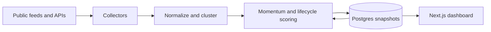

<p align="center">
  
</p>

<h1 align="center">Front Run</h1>

<p align="center">
  Catch emerging internet stories before they saturate.
</p>

<p align="center">
  <a href="https://front-run.onrender.com/"><strong>Open the live dashboard</strong></a>
  ·
  <a href="#run-locally">Run locally</a>
  ·
  <a href="#deploy-on-render">Deploy</a>
</p>

Front Run is a live early-signal dashboard for tracking internet trends across news, search, social samples and specialist sources. It clusters related observations, measures momentum across five time windows and estimates whether each signal is igniting, accelerating, peaking or cooling.

The main board is strictly about narratives and cultural trends. Any platform-specific market radar remains separate from the primary trend ranking.

## What it does

- Tracks up to roughly 250 active signals without clearing the board during refreshes.
- Separates **first detected** time from the age of the newest source.
- Scores movement across 5-minute, 30-minute, 60-minute, 6-hour and 24-hour windows.
- Organizes trends into Memes, Animals, Technology, News, Viral Events, Internet Culture, Entertainment, Sports and Food & Drink.
- Keeps deep animal coverage across cats, dogs, bears, birds, marine life, wildlife and zoo stories.
- Tracks named memes and formats while filtering roundups, promotional submissions and finance headlines.
- Shows source links, leading public posts when sampled, trajectory, saturation and a structured next-move forecast.
- Supports newest-detected, oldest-detected and viral-score sorting.

## Data sources

Front Run uses source-native measurements and labels samples explicitly. It does not invent platform counts.

- Google Trends and Google News RSS
- Know Your Meme discovery, trending and resurgence surfaces
- Direct technology, national news, animal, wildlife and zoo publishers
- Hacker News public API
- Cost-controlled X samples through TwitterAPI.io
- Optional YouTube Data API statistics
- Optional TikTok discovery through Bright Data
- Optional OpenAI-written classification and forecast copy
- A separate Pump.fun attention surface using public listing metadata

If a provider is not configured or temporarily fails, the dashboard reports that state and continues with the remaining sources.

## How it works



Every five minutes, the scheduled collector reads available sources, clusters related titles and stores a new snapshot. Historical observations supply measured velocity. Rediscovered trends retain their original detection time, while new evidence updates their latest-source time and confidence.

The public trend API only reads the most recent stored snapshot. Collection is performed by the scheduled job or the bearer-protected ingestion endpoint, preventing public visitors from triggering paid provider work.

## Run locally

Requirements: Node.js 22.13 or newer.

```bash
git clone https://github.com/openclawprison/front-run.git
cd front-run
npm ci
cp .env.example .env.local
npm run dev
```

Open [http://localhost:3000](http://localhost:3000). Without `DATABASE_URL`, local development uses explicit ephemeral storage.

### Environment variables

Never commit real credentials. `.env*` files are ignored except for the empty `.env.example` template.

| Purpose | Variables |
| --- | --- |
| Persistent history | `DATABASE_URL`, `DATABASE_SSL` |
| Protected ingestion | `INGEST_SECRET` |
| X samples | `TWITTERAPI_IO_KEY` and the `TWITTERAPI_*` controls |
| YouTube | `YOUTUBE_API_KEY`, `YOUTUBE_REGIONS` |
| TikTok | `BRIGHTDATA_API_TOKEN` and the `TIKTOK_*` controls |
| Forecast copy | `OPENAI_API_KEY`, `OPENAI_MODEL` |
| Pump.fun limits | `PUMPFUN_LIMIT`, `PUMPFUN_ENRICH_LIMIT` |

The public Google, publisher, Know Your Meme and Hacker News collectors work without API credentials.

## Quality checks

```bash
npm run lint
npm test
```

The test command runs a production Next.js build plus rendered-source and collector tests.

## Deploy on Render

The included [`render.yaml`](render.yaml) Blueprint defines:

- A Next.js web service
- A Postgres database
- A five-minute ingestion cron job
- Generated secret wiring and optional provider-key placeholders
- A database health check

To deploy:

1. Fork or clone the repository into your GitHub account.
2. In Render, select **New → Blueprint** and connect the repository.
3. Add only the provider credentials you intend to use.
4. Apply the Blueprint.
5. Trigger the ingestion cron once to create the first stored baseline.

Render can deploy this project from either a public or private GitHub repository.

## API surface

- `GET /api/health` — sanitized service and storage health
- `GET /api/trends` — latest stored trend payload; does not trigger ingestion in production
- `POST /api/ingest` — protected collection endpoint requiring `Authorization: Bearer <INGEST_SECRET>`

## Accuracy and safety

- X and TikTok metrics are samples, not complete platform-wide totals.
- Creator-provided links remain labeled as unverified until independent evidence matches them.
- Forecasts are directional research signals, not guarantees.
- The separate market-attention surface is not financial advice or an endorsement.

## License

This repository is publicly viewable, but no open-source license is currently granted. Unless a license is added later, reuse, redistribution and commercial deployment require permission from the repository owner.
