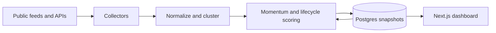

<p align="center">
  
</p>

<h1 align="center">Front Run</h1>

<p align="center">
  Meet the animal before it goes viral.
</p>

<p align="center">
  <a href="https://front-run.onrender.com/"><strong>Open the live dashboard</strong></a>
  ·
  <a href="#run-locally">Run locally</a>
  ·
  <a href="#deploy-on-render">Deploy</a>
</p>

Front Run is a dedicated animal-news signal dashboard. It finds the latest animal stories across publishers, zoos, aquariums, search and social samples, clusters related coverage, and estimates whether each animal is igniting, accelerating, peaking or cooling.

## What it does

- Tracks up to roughly 180 active animal stories without clearing the board during refreshes.
- Separates **first detected** time from the age of the newest source.
- Scores movement across 5-minute, 30-minute, 60-minute, 6-hour and 24-hour windows.
- Organizes animal stories into Viral Animals, Zoo Babies, Rescues, Cats, Dogs, Bears, Birds, Marine Life, Primates, Reptiles, Farm Animals, Endangered and Wildlife.
- Gives freshness, social confirmation, named-animal hooks and cross-publisher pickup extra weight.
- Filters sportspeople, teams, finance language and other false positives that happen to contain animal words.
- Shows source links, leading public posts when sampled, trajectory, saturation and a structured next-move forecast.
- Supports newest-detected, oldest-detected and viral-score sorting.

## Data sources

Front Run uses source-native measurements and labels samples explicitly. It does not invent platform counts.

- Animal-filtered Google Trends and 19 focused Google News discovery feeds
- 31 direct animal, pet, wildlife, conservation, zoo and aquarium publishers
- Cost-controlled X samples through TwitterAPI.io
- Optional animal-filtered YouTube Data API statistics
- Optional animal-keyword TikTok discovery through Bright Data
- Optional OpenAI-written animal summaries and forecast copy

If a provider is not configured or temporarily fails, the dashboard reports that state and continues with the remaining sources.

## How it works



Every five minutes, the scheduled collector reads available sources, clusters related titles and stores a new snapshot. Historical observations supply measured velocity. Rediscovered trends retain their original detection time, while new evidence updates their latest-source time and confidence.

The public trend API only reads the most recent stored snapshot. Collection is performed by the scheduled job or the bearer-protected ingestion endpoint, preventing public visitors from triggering paid provider work.

## Run locally

Requirements: Node.js 22.13 or newer.

```bash
git clone https://github.com/openclawprison/front-run.git
cd front-run
npm ci
cp .env.example .env.local
npm run dev
```

Open [http://localhost:3000](http://localhost:3000). Without `DATABASE_URL`, local development uses explicit ephemeral storage.

### Environment variables

Never commit real credentials. `.env*` files are ignored except for the empty `.env.example` template.

| Purpose | Variables |
| --- | --- |
| Persistent history | `DATABASE_URL`, `DATABASE_SSL` |
| Protected ingestion | `INGEST_SECRET` |
| X samples | `TWITTERAPI_IO_KEY` and the `TWITTERAPI_*` controls |
| YouTube | `YOUTUBE_API_KEY`, `YOUTUBE_REGIONS` |
| TikTok | `BRIGHTDATA_API_TOKEN` and the `TIKTOK_*` controls |
| Forecast copy | `OPENAI_API_KEY`, `OPENAI_MODEL` |

The public Google and direct animal-publisher collectors work without API credentials.

## Quality checks

```bash
npm run lint
npm test
```

The test command runs a production Next.js build plus rendered-source and collector tests.

## Deploy on Render

The included [`render.yaml`](render.yaml) Blueprint defines:

- A Next.js web service
- A Postgres database
- A five-minute ingestion cron job
- Generated secret wiring and optional provider-key placeholders
- A database health check

To deploy:

1. Fork or clone the repository into your GitHub account.
2. In Render, select **New → Blueprint** and connect the repository.
3. Add only the provider credentials you intend to use.
4. Apply the Blueprint.
5. Trigger the ingestion cron once to create the first stored baseline.

Render can deploy this project from either a public or private GitHub repository.

## API surface

- `GET /api/health` — sanitized service and storage health
- `GET /api/trends` — latest stored trend payload; does not trigger ingestion in production
- `POST /api/ingest` — protected collection endpoint requiring `Authorization: Bearer <INGEST_SECRET>`

## Accuracy and safety

- X and TikTok metrics are samples, not complete platform-wide totals.
- Forecasts are directional research signals, not guarantees.

## License

This repository is publicly viewable, but no open-source license is currently granted. Unless a license is added later, reuse, redistribution and commercial deployment require permission from the repository owner.
